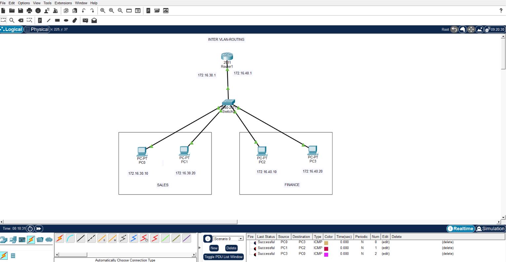

# CCNA Inter-VLAN Routing Project

## Project Overview

This project demonstrates Inter-VLAN Routing using the Router-on-a-Stick method in Cisco Packet Tracer. Multiple VLANs are configured on a Cisco Switch, and routing between VLANs is achieved using router sub-interfaces and 802.1Q trunking.

## Objectives

- Create and configure VLANs
- Configure trunk links between switch and router
- Configure router sub-interfaces
- Enable communication between different VLANs
- Verify connectivity using ping tests

## VLAN Details

| VLAN ID | Department |
|----------|------------|
| 30 | SALES |
| 40 | FINANCE |

## Devices Used

- Cisco Router (2911)
- Cisco Switch (2960)
- 4 PCs
- Cisco Packet Tracer

## IP Addressing

| Device | IP Address | Default Gateway |
|----------|----------|----------|
| PC1 | 172.16.30.10 | 172.16.30.1 |
| PC2 | 172.16.30.20 | 172.16.30.1 |
| PC3 | 172.16.40.10 | 172.16.40.1 |
| PC4 | 172.16.40.20 | 172.16.40.1 |

## Network Topology



## Features

- VLAN Configuration
- Trunk Port Configuration
- Router-on-a-Stick
- Inter-VLAN Routing
- IP Addressing
- Connectivity Verification
- Network Troubleshooting

## Switch Configuration

```bash
enable
conf t

vlan 30
name SALES

vlan 40
name FINANCE

interface range fa0/1-2
switchport mode access
switchport access vlan 30

interface range fa0/3-4
switchport mode access
switchport access vlan 40

interface fa0/24
switchport mode trunk

end
wr
```

## Router Configuration

```bash
enable
conf t

interface g0/0
no shutdown

interface g0/0.30
encapsulation dot1Q 30
ip address 172.16.30.1 255.255.255.0

interface g0/0.40
encapsulation dot1Q 40
ip address 172.16.40.1 255.255.255.0

end
wr
```

## Verification Commands

### Switch

```bash
show vlan brief
show interfaces trunk
```

### Router

```bash
show ip interface brief
show running-config
```

## Connectivity Test Results

✅ PC1 can communicate with PC2

✅ PC3 can communicate with PC4

✅ PC1 can ping PC3

✅ PC2 can ping PC4

✅ Inter-VLAN Routing Successful

## Skills Demonstrated

- VLAN Configuration
- VLAN Segmentation
- Trunking (802.1Q)
- Router Sub-Interfaces
- Inter-VLAN Routing
- IP Addressing
- Cisco IOS Configuration
- Network Troubleshooting

## Project Files

- InterVLAN_Routing.pkt
- Topology.png
- Router_Config.txt
- Switch_Config.txt
- README.md
